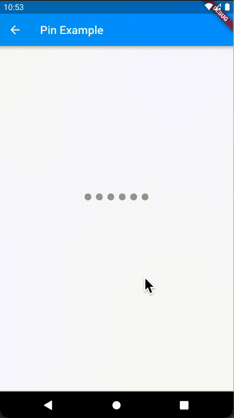

# iosish_shaker [![pub version][pub-version-img]][pub-version-url]

🍸 A widget that allows you to shake your widgets, just like the pin on iOS is shaked on incorrect input.



## Why?

I use this exact animation pretty often. So instead of recreating it every time, I decided to move it to a separate package.

## How to use

### Install it:

```
dependencies:
  iosish_shaker: ^1.0.0
```

### Example

#### Create a controller
```dart
final controller = ShakerController();
```

#### Use the shaker widget
```dart
return Shaker(
  controller: controller,
  child: child,
);
```

#### Shake, shake, shake! 
```dart
await controller.shake();

// The future is released when the animation is completed.
// So you can perform some action right after if you want to.
```

<!-- References -->
[pub-version-img]: https://img.shields.io/badge/pub-v1.0.0-0175c2?logo=flutter
[pub-version-url]: https://pub.dev/packages/iosish_shaker
